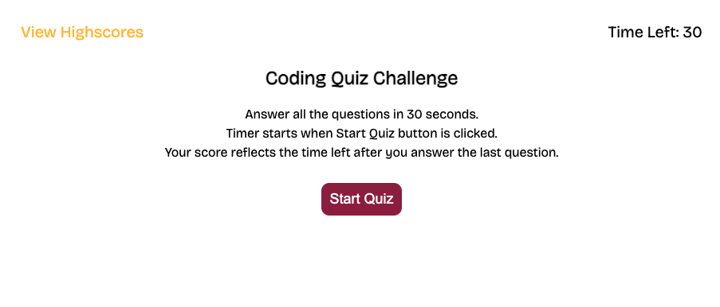

# codequiz
Bootcamp Module 4: Code Quiz (Timed / Record High Scores)

## Web APIs Challenge: Code Quiz

In this project, we were asked to build a timed coding quiz with multiple-choice questions. This app runs in the browser and will feature dynamically updated HTML and CSS powered by JavaScript code. 

I've set it so that there is a timer set to 30 seconds. The user has 30 seconds to answer 2 coding questions. When the "start quiz" button is clicked, the timer starts counting down and the questions randomly display for the user to answer. The user will be asked to enter their initials after the last question is answered. A wrong answer will deduct 15 seconds from the time left/total score. The time remaining is recorded along with the user's initials in the Leaderboard list display as the total score. The user can then click the "**clear scores**" button to clear the scores list or the "**restart**" button to restart the quiz. In this application, the Coundown Clock/Time Left is displayed at the top right portion of the page. The "view highscores" link is displayed on the top left portion of the page. 

## URLs Submitted

* URL of Application: https://lenzlee.github.io/codequiz

* URL of GitHub Repo: https://github.com/lenzlee/codequiz

## Resources

I mostly referred to our **HTML, CSS, and Javascript** lessons/activities for this assignment. 

I also applied some **Google Fonts** (https://fonts.google.com/).

I also used **MDN web docs** for reference when using the **_addEventListener() method, Math.random() static method, forEach() method, setInterval() and clearInterval() global functions_** for the coundown timer

For the quiz questions, I used 2 of the questions provided in the mockup.

## My Application Screenshot

## Mockup Provided

